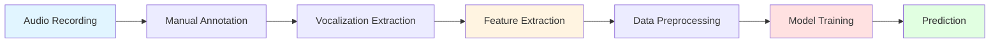

# ASDSpeech Prototype Development Roadmap

> **Created:** February 2026  
> **Purpose:** Complete guide for building an accurate autism severity estimation system from speech recordings

---

## 📋 Executive Summary

This roadmap provides step-by-step guidance for building a **more accurate** prototype of the ASDSpeech system — a deep learning application that estimates autism severity from speech recordings using Convolutional Neural Networks (CNNs).

### Original System Overview
- **Research Paper:** "Reliably quantifying the severity of social symptoms in children with autism using ASDSpeech" (Translational Psychiatry, 2025)
- **Purpose:** Estimate ADOS-2 scores (SA, RRB, Total) from child speech during diagnostic assessments
- **Dataset:** 136 training recordings + 122 test recordings (61 children × 2 time points)
- **Features:** 49 acoustic + conversational features per recording (100×49 matrix)
- **Architecture:** Custom CNN with 5-fold cross-validation and hyperparameter tuning

---

## 🏗️ System Architecture

### High-Level Pipeline



### Component Breakdown

#### 1. **Data Collection & Annotation**
- ADOS-2 assessment recordings (~40 minutes each)
- Microphone: AKG CHM99 (1-2m from child)
- Sampling rate: 44.1 kHz → downsampled to 16 kHz
- Manual labeling: child, therapist, parent, simultaneous speech, noise, silence

#### 2. **Feature Extraction**
- **Acoustic Features:** pitch, jitter, formants (F1, F2), bandwidth, energy, voicing, spectral slope
- **Conversational Features:** vocalization duration, total vocalizations count
- **Output:** 100×49 feature matrix per recording (5 random matrices per child)

#### 3. **CNN Model Architecture**
```
Input (100, 49, 1)
    ↓
Conv1D (256 filters, kernel=3, ReLU) + MaxPool1D (pool=3)
    ↓
Conv1D (256 filters, kernel=3, ReLU)
    ↓
Dense (1024, ReLU) + Dropout (0.5)
    ↓
Dense (512, ReLU) + Dropout (0.5)
    ↓
Dense (256, ReLU)
    ↓
Dense (128, ReLU)
    ↓
Flatten
    ↓
Dense (1, linear) → Severity Score
```

#### 4. **Training Strategy**
- **Cross-Validation:** Stratified 5-fold
- **Hyperparameter Tuning:** 100 iterations per fold
  - Batch size: 2³ to 2⁶ (8-64)
  - Epochs: 10-2000 (step=10)
  - Learning rate: 10⁻⁵ to 10⁰
- **Optimizer:** RMSprop
- **Loss:** MSE with custom correlation metric
- **Early Stopping:** 20 epochs patience
- **Evaluation Metrics:** RMSE, NRMSE, Pearson R, Spearman R, CCC

---

## 🚀 Implementation Roadmap

### Phase 1: Environment Setup (Week 1)

#### Step 1.1: Install Dependencies
```bash
# Create conda environment
conda env create -f requirements.yml
conda activate myASE_feats_env
```

**Key Dependencies:**
- Python 3.9.13
- TensorFlow-GPU 2.6.0 / Keras 2.6.0
- NumPy 1.22.3, Pandas 2.0.2, Scikit-learn 1.1.3
- Praat-Parselmouth 0.4.3 (audio processing)
- PyYAML 6.0, Matplotlib 3.5.3

#### Step 1.2: Setup GPU Environment
```python
# Configure GPU visibility
os.environ["CUDA_VISIBLE_DEVICES"] = "0"  # Set in config
os.environ['TF_CPP_MIN_LOG_LEVEL'] = '2'  # Suppress TF warnings
```

#### Step 1.3: Verify Installation
```bash
python -c "import tensorflow as tf; print(tf.config.list_physical_devices('GPU'))"
```

---

### Phase 2: Data Collection & Preparation (Weeks 2-4)

#### Step 2.1: Recording Setup
- **Hardware:**
  - Professional microphone (AKG CHM99 or equivalent)
  - Audio interface (TASCAM US-16x08 or equivalent)
- **Settings:**
  - Sample rate: 44.1 kHz, 16-bit
  - Distance: 1-2 meters from subject
  - Duration: Full ADOS-2 assessment (~40 min)

#### Step 2.2: Manual Annotation
Create labeled segments for:
- Child vocalizations (speech, laughing, moaning, crying, screaming)
- Therapist speech
- Parent speech
- Simultaneous speech
- Noise
- Silence

**Tools:** Audacity, Praat, or custom annotation software

#### Step 2.3: Data Organization
```
data/
├── train_data.mat          # Training features (136 recordings)
├── data_T1.yaml            # Test time-point 1 recording list
├── data_T2.yaml            # Test time-point 2 recording list
├── data_T1_info.xlsx       # T1 metadata (age, scores, gender)
└── data_T2_info.xlsx       # T2 metadata
```

**MATLAB .mat structure:**
```matlab
features: [n_recordings × 1 cell] → each cell: [100 × 49 double]
rec_id: [n_recordings × 1 cell]
ADOS: [n_recordings × 1 double]  % Total score
sa: [n_recordings × 1 double]     % Social Affect
rrb: [n_recordings × 1 double]    % Restricted/Repetitive Behaviors
gender: [n_recordings × 1 double] % 0=boys, 1=girls
module: [n_recordings × 1 double] % ADOS module
num_matrices: scalar              % Number of matrices per recording (5)
```

---

### Phase 3: Feature Extraction (Weeks 5-6)

#### Step 3.1: Extract Pitch, Formants, Voicing
```bash
cd feature_extraction
python main_run_pitch_extraction_recs.py
```

**Configuration in `main_run_pitch_extraction_recs.py`:**
```python
path_recs = "path/to/audio/files"
save_path = "path/to/save/features"
pitch_floor = 75   # Hz, adjust for age/gender
pitch_ceiling = 600  # Hz
```

**Output Files:**
- `Pitch/pitch_<rec_name>.txt`
- `Formants/formants_<rec_name>.txt` (F1, F2, BW1, BW2)
- `Voicing/voicing_<rec_name>.txt`

#### Step 3.2: Install & Run Feature Extraction App
1. Install: `MyAppInstaller_web.exe`
2. Launch the app
3. Follow instructions in `ASDspeech feature extraction app manual.pdf`
4. Extract all 49 features

**49 Features Include:**
- Pitch statistics (mean, std, min, max, quartiles)
- Jitter, shimmer
- Formant frequencies (F1, F2) + bandwidths
- Energy, voicing probability
- Spectral slope, harmonic-to-noise ratio
- Vocalization duration, count, rate
- Pause statistics

#### Step 3.3: Generate Multiple Feature Matrices
For each recording, create **5 random feature matrices** by:
- Randomly selecting different subsets of vocalizations
- Computing statistics over 100 time windows
- Ensuring diversity for robust training

---

### Phase 4: Model Development (Weeks 7-10)

#### Step 4.1: Configuration Setup
Edit `config/config_file.yaml`:
```yaml
paths_config:
    data_file_path: 'data/train_data.mat'
    save_path: 'results/temp'

params_config:
    score_name: "ADOS"  # or "sa", "rrb"
    model_name: "CNN_mdl"
    k_folds: 5
    num_mats_take: 5
    feats_take: 49
    norm_method: "standard"  # z-normalization
    data_norm_by: "mat"
    random_state: 1337
    GPU_id: 0
    early_stopping:
        eval: True
        patience: 20

hyper_tune_config:
    calculate: 'tune'  # or 'read', 'load'
    n_iters: 100
    cv_k: 4
    statistic: "CCC"  # Choose best model by CCC
```

#### Step 4.2: Code Architecture Overview

**Key Modules:**

1. **`main_script.py`** - Entry point
   - Loads config
   - Initializes `TrainTestKFold` class
   - Executes full pipeline

2. **`read_data.py`** - Data loading
   - Reads .mat files
   - Creates pandas DataFrames
   - Filters by gender/module
   - Generates X (features) and y (scores)

3. **`models_class.py`** - CNN architecture
   - Defines `CNN_mdl()` with layers
   - Custom correlation loss function
   - RMSprop optimizer

4. **`hyper_tune.py`** - Hyperparameter search
   - Random search over 100 combinations
   - 4-fold CV for validation
   - Saves best params based on CCC

5. **`train_and_test_kfold.py`** - Training pipeline
   - Stratified K-fold cross-validation
   - Normalization (z-score per feature)
   - Model training with early stopping
   - Prediction on train/test sets
   - Performance evaluation (RMSE, R, CCC)
   - Model + transformer saving

6. **`commons_functions.py`** - Utilities
   - `norm_data_by_mat()`: z-normalization
   - `predict_data()`: inference + metrics
   - `plot_loss()`, `plot_pred_true()`: visualization

#### Step 4.3: Training Execution
```bash
cd code
python main_script.py -c ../config/config_file.yaml
```

**Execution Flow:**
1. Load data → Filter → Create X, y
2. For each of 5 feature matrices:
   - For each of 5 folds:
     - Split data (stratified)
     - Normalize features (z-score)
     - Hyperparameter tuning (100 iterations × 4 CV folds)
     - Train model with best params
     - Test on hold-out fold
     - Save model, weights, transformer, results
3. Aggregate results across folds and matrices

**Output Structure:**
```
results/ADOS_prediction/136recs_5folds/CNN_mdl/
├── Random_mat_1/
│   ├── Trial1/
│   │   ├── Best_CCC/
│   │   │   ├── Model.json
│   │   │   ├── Model_weights.h5
│   │   │   ├── Transformer.pkl
│   │   │   ├── Pred_true_train.txt
│   │   │   ├── Pred_true_test.txt
│   │   │   ├── Parameters&Results.txt
│   │   │   └── Loss_fig.png
│   │   └── Hyper_tune/
│   │       └── Mean_CV_results.csv
│   ├── Trial2/ ...
│   └── Trial5/
├── Random_mat_2/ ...
├── Random_mat_5/
└── Best_CCC/
    ├── Run_results_train.csv
    ├── Run_results_test.csv
    ├── Mean_allDatas_allStatistics.xlsx
    ├── config_file.yaml
    └── scripts/
```

---

### Phase 5: Model Evaluation (Weeks 11-12)

#### Step 5.1: Test on Independent Dataset
Edit `config/config_file_trained_mdl.yaml`:
```yaml
paths_config:
    data_test_T1: 'data/data_T1.yaml'
    data_test_T2: 'data/data_T2.yaml'
    trained_model_folder: 'results/ADOS_prediction/136recs_5folds/CNN_mdl/Best_CCC'
```

Run prediction:
```bash
python estimate_recs_trained_mdl.py -c ../config/config_file_trained_mdl.yaml
```

#### Step 5.2: Calculate Mean Scores
```bash
python estimate_recs_trained_mdl_mean_score.py -c ../config/config_file_trained_mdl.yaml
```

This averages predictions from all 25 models (5 matrices × 5 folds).

#### Step 5.3: Performance Metrics
Evaluate using:
- **RMSE:** Root Mean Squared Error
- **NRMSE:** Normalized RMSE (RMSE / range)
- **Pearson R:** Linear correlation
- **Spearman R:** Rank correlation
- **CCC:** Concordance Correlation Coefficient (agreement)

---

## 🎯 Accuracy Improvement Strategies

### 1. **Data Quality Enhancements**

#### Better Annotation
- Use inter-rater reliability (multiple annotators)
- Automated voice activity detection (VAD) + manual review
- Time-aligned transcripts for linguistic features

#### Larger Dataset
- Collect more recordings (target: 300-500 for training)
- Diverse demographics (age, gender, ethnicity, module)
- Longitudinal data (multiple time points per child)

#### Balanced Data
- Stratify by severity scores (avoid imbalance)
- Augmentation: pitch shifting, time stretching (cautiously)

---

### 2. **Advanced Feature Engineering**

#### Additional Acoustic Features
- **Mel-Frequency Cepstral Coefficients (MFCCs):** 13-39 coefficients
- **Zero-Crossing Rate (ZCR):** Voice quality indicator
- **Spectral Features:** centroid, bandwidth, rolloff, flux
- **Harmonic-to-Noise Ratio (HNR):** Voice clarity
- **Vocal Tract Length Normalization (VTLN):** Age/gender adaptation

#### Linguistic Features
- **Automatic Speech Recognition (ASR):**
  - Word count, vocabulary diversity
  - Part-of-speech distribution
  - Pronoun usage (e.g., "I" vs. "you")
- **Disfluency Analysis:** Repetitions, fillers, pauses
- **Prosody:** Intonation contours, stress patterns

#### Interaction Features
- Turn-taking dynamics (latency, overlap)
- Therapist-child synchrony
- Question-response patterns

---

### 3. **Model Architecture Improvements**

#### Deep Learning Enhancements

**A. Deeper CNN with Residual Connections**
```python
# Add skip connections to prevent vanishing gradients
from tensorflow.keras.layers import Add, BatchNormalization

def residual_block(x, filters):
    shortcut = x
    x = Conv1D(filters, 3, padding='same', activation='relu')(x)
    x = BatchNormalization()(x)
    x = Conv1D(filters, 3, padding='same')(x)
    x = Add()([x, shortcut])
    x = Activation('relu')(x)
    return x
```

**B. Attention Mechanisms**
```python
from tensorflow.keras.layers import MultiHeadAttention

# Self-attention to focus on critical time windows
attention = MultiHeadAttention(num_heads=4, key_dim=64)(x, x)
```

**C. Recurrent Networks (LSTM/GRU)**
```python
from tensorflow.keras.layers import LSTM, Bidirectional

# Capture temporal dependencies in speech
x = Bidirectional(LSTM(128, return_sequences=True))(x)
x = Bidirectional(LSTM(64))(x)
```

**D. Transformer Architecture**
```python
# State-of-the-art sequence modeling
from tensorflow.keras.layers import MultiHeadAttention, LayerNormalization

for _ in range(4):  # 4 transformer blocks
    attn = MultiHeadAttention(num_heads=8, key_dim=64)(x, x)
    x = LayerNormalization()(x + attn)
    ff = Dense(256, activation='relu')(x)
    ff = Dense(128)(ff)
    x = LayerNormalization()(x + ff)
```

**E. Hybrid CNN-Transformer**
```python
# CNN for local patterns + Transformer for long-range dependencies
x = Conv1D(256, 3, activation='relu')(input)
x = MaxPool1D(2)(x)
x = MultiHeadAttention(num_heads=4, key_dim=64)(x, x)
x = Flatten()(x)
x = Dense(512, activation='relu')(x)
output = Dense(1)(x)
```

#### Ensemble Methods
- Train multiple architectures (CNN, LSTM, Transformer)
- Weighted voting based on validation performance
- Stacking: Use meta-learner on predictions

---

### 4. **Training Optimizations**

#### Advanced Regularization
```python
# L1/L2 regularization
from tensorflow.keras.regularizers import l1_l2
Dense(512, activation='relu', kernel_regularizer=l1_l2(l1=1e-5, l2=1e-4))

# Dropout variations
from tensorflow.keras.layers import SpatialDropout1D
SpatialDropout1D(0.2)  # Drop entire feature maps
```

#### Better Optimizers
```python
# AdamW with weight decay
from tensorflow.keras.optimizers import AdamW
optimizer = AdamW(learning_rate=1e-4, weight_decay=1e-5)

# Learning rate scheduling
from tensorflow.keras.callbacks import ReduceLROnPlateau
lr_scheduler = ReduceLROnPlateau(monitor='val_loss', factor=0.5, patience=5)
```

#### Data Augmentation
```python
# SpecAugment for audio
def spec_augment(features, mask_param=10):
    # Time masking
    t_mask = np.random.randint(0, mask_param)
    t0 = np.random.randint(0, features.shape[0] - t_mask)
    features[t0:t0+t_mask, :] = 0
    
    # Frequency masking
    f_mask = np.random.randint(0, mask_param)
    f0 = np.random.randint(0, features.shape[1] - f_mask)
    features[:, f0:f0+f_mask] = 0
    return features
```

#### Transfer Learning
```python
# Pre-train on related tasks (emotion recognition, speaker ID)
# Fine-tune on ADOS prediction
base_model.trainable = False  # Freeze initial layers
# Train only top layers initially
```

---

### 5. **End-to-End Learning**

#### Replace Hand-Crafted Features with Raw Audio
```python
from tensorflow.keras.layers import Conv1D, MaxPool1D

# Input: raw waveform (16000 samples × 1 channel for 1-sec segments)
input = Input(shape=(16000, 1))

# Multi-scale convolutional filters
x1 = Conv1D(64, kernel_size=1024, strides=160, activation='relu')(input)
x2 = Conv1D(64, kernel_size=512, strides=80, activation='relu')(input)
x3 = Conv1D(64, kernel_size=256, strides=40, activation='relu')(input)

# Concatenate multi-scale features
x = Concatenate()([x1, x2, x3])
x = MaxPool1D(2)(x)

# Additional layers...
```

#### Mel-Spectrogram CNN
```python
import librosa

# Convert audio to mel-spectrogram
mel_spec = librosa.feature.melspectrogram(y=audio, sr=16000, n_mels=128)
mel_db = librosa.power_to_db(mel_spec, ref=np.max)

# Input: (time_frames, 128 mel bins, 1)
# Use Conv2D layers
```

---

### 6. **Cross-Validation & Evaluation**

#### Nested Cross-Validation
```python
# Outer loop: 5-fold for performance estimation
# Inner loop: 4-fold for hyperparameter tuning
# Prevents overfitting to validation set
```

#### Stratification by Multiple Variables
```python
# Stratify by score + gender + module
from sklearn.model_selection import StratifiedKFold
stratify_var = data['score'] * 100 + data['gender'] * 10 + data['module']
```

#### Test-Time Augmentation (TTA)
```python
# Average predictions over multiple augmented versions
predictions = []
for aug in augmentations:
    aug_features = apply_augmentation(features, aug)
    pred = model.predict(aug_features)
    predictions.append(pred)
final_pred = np.mean(predictions, axis=0)
```

---

### 7. **Interpretability & Explainability**

#### Attention Visualization
```python
# Visualize which time windows the model focuses on
attention_weights = attention_layer.get_weights()
plt.plot(attention_weights)
plt.title('Attention over Time Windows')
```

#### Feature Importance
```python
# Permutation importance
from sklearn.inspection import permutation_importance
perm_importance = permutation_importance(model, X_test, y_test)
```

#### Grad-CAM for CNNs
```python
# Highlight discriminative regions in feature space
import tensorflow as tf

def grad_cam(model, features, layer_name):
    grad_model = tf.keras.models.Model(
        [model.inputs], [model.get_layer(layer_name).output, model.output]
    )
    with tf.GradientTape() as tape:
        conv_outputs, predictions = grad_model(features)
        loss = predictions[:, 0]
    grads = tape.gradient(loss, conv_outputs)
    # ... compute CAM
```

---

### 8. **Multi-Task & Multi-Modal Learning**

#### Multi-Task Learning
```python
# Jointly predict SA, RRB, Total ADOS
output_sa = Dense(1, name='sa')(shared_features)
output_rrb = Dense(1, name='rrb')(shared_features)
output_total = Dense(1, name='total')(shared_features)

model = Model(inputs=input, outputs=[output_sa, output_rrb, output_total])
model.compile(
    loss={'sa': 'mse', 'rrb': 'mse', 'total': 'mse'},
    loss_weights={'sa': 0.4, 'rrb': 0.4, 'total': 0.2}
)
```

#### Multi-Modal Fusion
```python
# Combine audio + video (facial expressions, gestures)
audio_branch = CNN_Audio(audio_input)
video_branch = CNN_Video(video_input)
fused = Concatenate()([audio_branch, video_branch])
output = Dense(1)(fused)
```

---

## 📊 Recommended Metrics & Benchmarks

### Primary Metrics
1. **Concordance Correlation Coefficient (CCC)** - Measures agreement
2. **Pearson R** - Linear correlation
3. **RMSE** - Absolute error magnitude

### Target Performance (Based on Original Paper)
- **Test-Retest Reliability:** CCC > 0.80 (excellent)
- **Cross-Validation:** R > 0.70, RMSE < 3 points

### Improvement Goals
- Increase CCC from 0.80 to **0.85+**
- Reduce RMSE by **15-20%**
- Improve generalization across modules/demographics

---

## 🛠️ Development Best Practices

### Version Control
```bash
git init
git add .
git commit -m "Initial ASDSpeech prototype"
```

### Experiment Tracking
- Use **MLflow** or **Weights & Biases** for:
  - Hyperparameter logging
  - Metrics tracking
  - Model versioning
  - Reproducibility

### Code Organization
```
ASDSpeech_v2/
├── config/
│   ├── base.yaml
│   ├── train.yaml
│   └── test.yaml
├── data/
│   ├── raw/
│   ├── processed/
│   └── splits/
├── src/
│   ├── data/
│   │   ├── preprocessing.py
│   │   ├── augmentation.py
│   │   └── feature_extraction.py
│   ├── models/
│   │   ├── cnn.py
│   │   ├── transformer.py
│   │   └── ensemble.py
│   ├── training/
│   │   ├── train.py
│   │   └── evaluate.py
│   └── utils/
│       ├── metrics.py
│       └── visualization.py
├── notebooks/
│   └── exploratory_analysis.ipynb
├── tests/
│   └── test_preprocessing.py
├── requirements.txt
└── README.md
```

### Testing
```python
# Unit tests for preprocessing
def test_feature_extraction():
    audio = load_test_audio()
    features = extract_features(audio)
    assert features.shape == (100, 49)
    assert not np.isnan(features).any()
```

### Documentation
- **Docstrings** for all functions/classes
- **README** with setup instructions
- **User guide** for clinicians
- **Technical report** with methodology

---

## 🔍 Debugging & Troubleshooting

### Common Issues

#### 1. GPU Out of Memory
```python
# Reduce batch size
batch_size = 8  # Instead of 64

# Enable mixed precision
from tensorflow.keras.mixed_precision import set_global_policy
set_global_policy('mixed_float16')
```

#### 2. Overfitting
- Increase dropout (0.5 → 0.6)
- Add more data augmentation
- Reduce model complexity
- Early stopping with patience=10

#### 3. Underfitting
- Increase model capacity (more layers/units)
- Train longer (more epochs)
- Reduce regularization
- Check for data leakage in normalization

#### 4. Unstable Training
```python
# Gradient clipping
optimizer = RMSprop(learning_rate=1e-4, clipnorm=1.0)

# Batch normalization
from tensorflow.keras.layers import BatchNormalization
x = BatchNormalization()(x)
```

---

## 📚 Additional Resources

### Research Papers
1. Original paper: [Translational Psychiatry](https://www.nature.com/articles/s41398-025-03233-6)
2. Transfer learning for speech: "wav2vec 2.0" (Baevski et al., 2020)
3. Attention mechanisms: "Attention Is All You Need" (Vaswani et al., 2017)

### Tools & Libraries
- **Audio Processing:** Librosa, Praat-Parselmouth, pydub
- **Deep Learning:** TensorFlow/Keras, PyTorch
- **Feature Extraction:** openSMILE, pyAudioAnalysis
- **Visualization:** Matplotlib, Seaborn, Plotly

### Datasets (for Pre-training)
- **VoxCeleb:** Speaker recognition
- **IEMOCAP:** Emotion recognition
- **CommonVoice:** General speech
- **TIMIT:** Phonetic diversity

---

## ✅ Quality Checklist

Before deploying:
- [ ] Model achieves CCC > 0.80 on independent test set
- [ ] Performance stable across demographics (gender, age, module)
- [ ] Predictions correlate with longitudinal changes (T1 vs T2)
- [ ] Code passes all unit tests
- [ ] Documentation complete (technical + user guides)
- [ ] Ethical review approved
- [ ] Privacy/security audit completed (HIPAA compliance)
- [ ] Clinical validation with domain experts
- [ ] Explainability analysis conducted

---

## 🎓 Key Takeaways

### Critical Success Factors
1. **High-Quality Annotations:** Accurate child speech segmentation is foundational
2. **Feature Engineering:** Combine acoustic + linguistic + interaction features
3. **Model Capacity:** Balance complexity with generalization
4. **Regularization:** Prevent overfitting with dropout, early stopping, augmentation
5. **Ensemble Learning:** Aggregate multiple models for robustness
6. **Clinical Validation:** Collaborate with clinicians for real-world utility

### Accuracy Improvement Priorities
**High Impact:**
1. Collect more diverse data (300+ recordings)
2. Add linguistic features (ASR-based)
3. Try Transformer architecture
4. Implement ensemble methods

**Medium Impact:**
5. Add attention mechanisms
6. Use advanced optimizers (AdamW)
7. Better hyperparameter search (Bayesian optimization)

**Lower Impact:**
8. Fine-tune normalization methods
9. Experiment with loss functions
10. Adjust Dropout rates

---

## 📞 Next Steps

1. **Immediate (Week 1):** Set up environment and verify GPU
2. **Short-term (Weeks 2-6):** Collect data and extract features
3. **Medium-term (Weeks 7-12):** Train baseline model and evaluate
4. **Long-term (Months 4-6):** Implement improvements and clinical validation

---

**Good luck building a more accurate ASDSpeech prototype!** 🚀

*For questions or collaboration, refer to the original research paper and codebase.*
